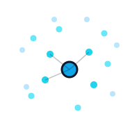

<p align="center">
  
</p>

# colonyx

**colonyx** is a Python library for solving optimization problems using swarm intelligence algorithms like Ant Colony Optimization (ACO), Particle Swarm Optimization (PSO), Artificial Bee Colony (ABC), Grey Wolf Optimization (GWO), Firefly (FA), Simulated Annealing (SA), Cuckoo Search (CS), Bat Algorithm (BA), Glowworm Swarm Optimization (GSO), Bacterial Foraging (BFO), and Differential Evolution (DE).

While the interface is Pythonic and easy to use, the core is written in Rust to deliver better performance for larger or more complex problems.

[](https://pypi.org/project/colonyx/)
[](https://minlee0210.github.io/colonyx/)

## Features

- Ant Colony Optimization (ACO) — for discrete problems like TSP
- Particle Swarm Optimization (PSO) — for continuous function optimization
- Artificial Bee Colony (ABC) — inspired by bee foraging behavior
- Grey Wolf Optimization (GWO), Firefly (FA), Simulated Annealing (SA)
- Cuckoo Search (CS), Bat Algorithm (BA), Glowworm Swarm Optimization (GSO)
- Bacterial Foraging (BFO), Differential Evolution (DE)
- CMA-ES for covariance-adaptive continuous search
- Binary PSO, permutation GA, NSGA-II, and MOPSO for advanced search
- ACO variants including ACS, elitist, and MMAS behavior
- Simple, clean Python API
- Fast backend powered by Rust

## Installation

```bash
pip install colonyx
```

## Example

All algorithms are used through the unified `AutoColony` interface, selected
via the `mode` parameter.

**Continuous optimization (PSO / ABC)** — minimize an objective function over a
box, given per-dimension `bounds`:

```python
from colonyx import AutoColony

def sphere(x):
    return sum(xi * xi for xi in x)  # minimum 0 at the origin

opt = AutoColony(mode="pso", n_iterations=150, random_state=42)
opt.fit(sphere, bounds=[(-5, 5), (-5, 5), (-5, 5)])

opt.predict()  # best position, ~ [0, 0, 0]
opt.score()    # objective value at that position, ~ 0

# Artificial Bee Colony works the same way:
AutoColony(mode="abc", n_iterations=200).fit(sphere, bounds=[(-5, 5)] * 3)
```

**Discrete optimization (ACO)** — find a short tour through a square distance
matrix (TSP):

```python
import numpy as np
from colonyx import AutoColony

distance_matrix = np.array([
    [0, 1, 9, 9, 1],
    [1, 0, 1, 9, 9],
    [9, 1, 0, 1, 9],
    [9, 9, 1, 0, 1],
    [1, 9, 9, 1, 0],
], dtype=float)

opt = AutoColony(mode="aco", n_iterations=100, random_state=42)
opt.fit(distance_matrix)

opt.predict()  # best tour, e.g. [0, 1, 2, 3, 4]
opt.score()    # tour length (lower is better)
```

Use `mode="auto"` to let colonyx pick ACO for a square matrix or PSO for an
objective function automatically.

For advanced optimizers, see `docs/algorithms/advanced.md`.

## Rust usage

The optimization core is implemented in Rust. If you are working on the Rust
side of the codebase, you can use the core types and optimizers directly:

```rust
use colonyx::algorithms::base::Optimizer;
use colonyx::algorithms::pso::ParticleSwarm;
use colonyx::core::{Bounds, ContinuousProblem};

fn main() {
    let bounds = Bounds::uniform(3, -5.0, 5.0).unwrap();
    let mut optimizer = ParticleSwarm::new(30, 100, 0.7, 1.5, 1.5, bounds);
    optimizer.set_random_seed(Some(42));

    let problem = ContinuousProblem {
        name: "sphere".to_string(),
        dimensions: 3,
        objective_function: Box::new(|x: &[f64]| x.iter().map(|xi| xi * xi).sum()),
    };

    optimizer.fit(&problem).unwrap();

    let best = optimizer.predict().unwrap();
    println!("best position: {:?}", best.variables);
    println!("best score: {:?}", optimizer.score().unwrap());
}
```

For discrete problems, use `AntColony` with `DiscreteProblem` and a distance
matrix.

## Documentation

- Library guide: `docs/index.md`
- AutoColony API: `docs/autocolony-api.md`
- CLI: `docs/cli.md`
- Getting started: `docs/getting-started.md`
- Algorithm overview: `docs/algorithms.md`
- Release and packaging notes: `docs/release.md`

## License

MIT
