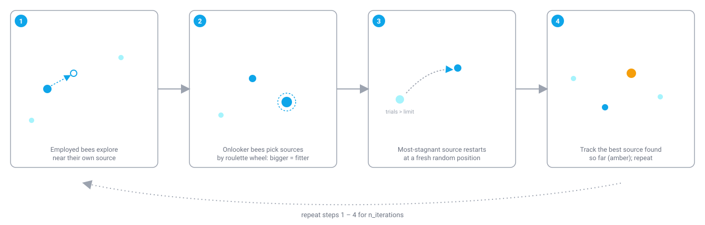

# Artificial Bee Colony (ABC)

!!! abstract "TL;DR"
    Artificial Bee Colony is a population-based continuous optimizer built around three bee roles — employed, onlooker, and scout — searching over a fixed set of candidate solutions ("food sources"). In colonyx it's `AutoColony(mode="abc")`, colonyx's other `auto`-selectable mode alongside PSO, and tends to scale better than PSO on higher-dimensional continuous problems.

## What is Artificial Bee Colony?

Artificial Bee Colony models how a honeybee colony forages for nectar. A food source's quality corresponds to how much nectar it offers and how easy it is to reach. Employed bees are each assigned to a specific food source and repeatedly search its immediate neighborhood for something better, reporting back what they find. Onlooker bees wait at the hive and choose which food source to visit next based on the information employed bees bring back — better sources get visited (and therefore refined) more often, exactly the way roulette-wheel selection is weighted by fitness. If a food source stops improving no matter how many times it's revisited, the colony eventually gives up on it: the employed bee assigned to it becomes a scout and flies off to discover an entirely new, random food source instead, so the colony never gets permanently stuck refining a source that has already been fully exploited.

<figure markdown>

<figcaption>Three distinct bee roles trade off exploitation (employed, onlooker) against exploration (scout) every single iteration.</figcaption>
</figure>

Translated into an optimizer, a "food source" is simply a candidate solution vector, and its "nectar amount" is how good the objective value at that point is. The employed-bee phase performs local exploitation (each source tries a small, randomized move influenced by another source), the onlooker-bee phase reinforces the phase's own findings by re-visiting the currently-best sources more often, and the scout-bee phase provides exploration by periodically replacing whichever source has gone the longest without improving. This three-phase division of labor is what lets ABC avoid getting trapped on a single stale local optimum while still spending most of its evaluation budget refining the sources that are actually working.

## How colonyx implements it

The core loop colonyx's Rust implementation (`colonyx._colonyx.BeeColony`) runs is:

```text
n_sources = max(n_bees // 2, 1)
sources = random init inside bounds
objective = evaluate(sources)                       # batched, in parallel
trials = [0] * n_sources                             # stagnation counters

for iteration in 1..n_iterations:
    # employed bee phase: one candidate per source
    for i in 1..n_sources:
        candidate = perturb source[i] toward a random partner source[k]
        if evaluate(candidate) < objective[i]:
            source[i], objective[i], trials[i] = candidate, evaluate(candidate), 0
        else:
            trials[i] += 1

    # onlooker bee phase: n_sources candidates, sources chosen by roulette
    # wheel weighted by selection_fitness(objective) (higher fitness = better)
    for _ in 1..n_sources:
        i = roulette_select(sources, weights = selection_fitness(objective))
        (same perturb-and-greedily-replace step as above, on source i)

    # scout bee phase: abandon the single most-stagnant source past `limit`
    i = argmax(trials)
    if trials[i] > limit:
        source[i] = random position; objective[i] = evaluate(source[i]); trials[i] = 0

    track best (source, objective) seen so far
```

Note that `n_bees` in the unified `AutoColony` interface controls `n_sources = n_bees // 2` — this reflects the real ABC model, where the employed-bee population and the food-source population are the same size, and onlooker bees are a second pass over that same set of sources rather than a separate population.

### The candidate-generation and selection math

A candidate neighbor of source \(i\) perturbs a single, randomly chosen dimension \(j\) using a randomly chosen partner source \(k \neq i\):

$$
v_{i,j} = x_{i,j} + \phi\,(x_{i,j} - x_{k,j}), \qquad \phi \sim U(-1, 1)
$$

(all other dimensions of \(v_i\) are copied unchanged from \(x_i\)). With only one source (\(n_{\text{sources}}=1\)), there's no partner to difference against, so it falls back to a small random walk on one dimension instead. The candidate is kept only if it strictly improves the source's objective value (greedy selection).

Onlooker bees pick a source by roulette wheel, weighted by a fitness transform of the raw (minimized) objective value \(f\):

$$
\text{fit}(f) = \begin{cases} \dfrac{1}{1+f} & f \ge 0 \\[4pt] 1 + |f| & f < 0 \end{cases}, \qquad
P_i = \frac{\text{fit}(f_i)}{\displaystyle\sum_k \text{fit}(f_k)}
$$

## When to use it (and when not to)

ABC is colonyx's other `auto`-selectable continuous optimizer, and `mode="auto"` reaches for it once a continuous problem's dimensionality climbs above 4 (see [Getting Started](../getting-started.md)) — the food-source/scout mechanism tends to hold up better than plain PSO as dimensionality grows, because the scout phase keeps injecting fresh diversity that a single global-best attractor can lose. It's a good default whenever you want a population-based continuous optimizer and are comfortable tuning one extra knob, `limit`, that controls how patient the colony is with a stagnant source. If you specifically need a *low*-dimensional, fast-converging baseline, plain [PSO](pso.md) is usually simpler to tune and just as effective. ABC does not handle discrete tour/permutation problems — use [ACO](aco.md) for those.

## Parameters

| Parameter | Default | Meaning | Tuning guidance |
|---|---|---|---|
| `n_bees` | `50` | Total bee count; the number of food sources is `n_bees // 2`. | Scale up for higher-dimensional problems so there are enough sources to cover the space; 40-80 is typical. |
| `limit` | `10` | Number of consecutive failed improvement trials before a source is abandoned by a scout. | Lower values explore more aggressively (sources get replaced sooner, at the cost of throwing away partially-refined solutions); higher values exploit more patiently before giving up on a source. |
| `n_iterations` | `100` | Number of colony iterations to run. | Increase for harder or higher-dimensional objectives. |

## Example

```python
from colonyx import AutoColony

optimizer = AutoColony(mode="abc", n_iterations=100, random_state=7)
optimizer.fit(lambda x: sum(v * v for v in x), bounds=[(-5, 5), (-5, 5)])
print(optimizer.predict(), optimizer.score())
```

## Further reading

- Karaboga, D. (2005). *An idea based on honey bee swarm for numerical optimization.* Technical Report TR06, Erciyes University — the original ABC algorithm.
- [Algorithms overview](../algorithms.md) — compare ABC against every other algorithm colonyx ships.
- [AutoColony API reference](../autocolony-api.md) — the full unified interface.
