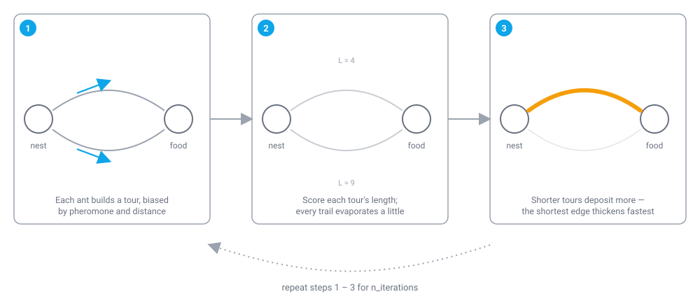

# Ant Colony Optimization (ACO)

!!! abstract "TL;DR"
    Ant Colony Optimization is a discrete, construction-based metaheuristic for combinatorial problems — the canonical use case is the Traveling Salesman Problem, where a colony of virtual ants builds tours and reinforces the shortest ones with pheromone. In colonyx it's available as `AutoColony(mode="aco")`, takes a plain square distance matrix as input rather than a callable objective, and its Rust core also supports four pheromone-update variants (`basic`, `acs`, `elitist`, `mmas`) — see [ACO Variants](aco-variants.md).

## What is Ant Colony Optimization?

Ant Colony Optimization takes its name from the way real ant colonies find short paths between their nest and a food source. An individual ant wandering alone has no idea which route is shortest, but as ants travel back and forth they deposit a chemical trail called pheromone, and ants passing later are more likely to follow trails with a stronger pheromone concentration. Because shorter paths get walked (and therefore reinforced) more often per unit time than longer ones, the pheromone trail on the short path builds up faster, and over many trips the colony's traffic converges almost entirely onto the shortest route — without any single ant ever "knowing" the whole map.

<figure markdown>

<figcaption>The short path gets walked more often per unit time, so its pheromone builds up faster than it can evaporate.</figcaption>
</figure>

ACO simulates this process computationally to solve combinatorial optimization problems, most famously the Traveling Salesman Problem (TSP): given a set of cities and the distances between them, find the shortest tour that visits every city exactly once and returns to the start. Each simulated ant builds a complete tour city by city, choosing the next city with a probability that combines two signals — how much pheromone is on that edge (the colony's learned experience of what has worked well) and a heuristic value that's just the inverse of the edge's distance (a myopic preference for shorter hops). After every ant in the colony finishes its tour, pheromone evaporates a little on every edge (so the colony can forget stale information and keep exploring) and is then redeposited on the edges that good tours actually used, proportional to how good those tours were. Repeating this construct-evaporate-deposit cycle for many iterations causes the colony's collective behavior to converge toward consistently short tours, the same way real ant traffic converges onto short physical paths.

## How colonyx implements it

The core loop that colonyx's Rust implementation (`colonyx._colonyx.AntColony`) runs each iteration is:

```text
initialize pheromone[i][j] = 1 / n_cities for all edges
best_tour = None

for iteration in 1..n_iterations:
    solutions = []
    for ant in 1..n_ants:
        tour = [random start city]
        while unvisited cities remain:
            if variant == "acs" and random() < q0:
                next_city = argmax over unvisited of pheromone[cur][c]^alpha * (1/distance[cur][c])^beta
            else:
                # roulette-wheel selection weighted by the same quantity
                next_city = roulette_select(unvisited, weight = pheromone^alpha * (1/distance)^beta)
            tour.append(next_city)
        if use_two_opt: tour = two_opt(tour, distance_matrix)
        length = evaluate(tour)
        if length < best_length: best_tour, best_length = tour, length
        solutions.append((tour, length))

    # pheromone update, once per iteration
    pheromone *= (1 - rho)                      # evaporation, every edge
    if variant != "acs":
        for (tour, length) in solutions:
            deposit q / length on every edge of tour       # all ants deposit
    if variant in {"elitist", "acs", "mmas"}:
        deposit elitist_weight * q / best_length on every edge of best_tour
    if variant == "mmas":
        clamp every pheromone[i][j] to [tau_min, tau_max]
```

If `use_two_opt=True` (the default), colonyx locally refines every ant's tour with the classic 2-opt heuristic before scoring it — repeatedly reversing a segment of the tour whenever doing so shortens it — which noticeably tightens tours without changing the pheromone logic at all. The `two_opt` function is also exported standalone (`from colonyx import two_opt`) if you want to post-process a tour you built some other way.

### The pheromone-update math

An ant at city \(i\) chooses the next unvisited city \(j\) by roulette-wheel selection weighted by pheromone and inverse distance:

$$
P_{ij} = \frac{\tau_{ij}^{\alpha}\,\eta_{ij}^{\beta}}{\displaystyle\sum_{l \in \text{allowed}} \tau_{il}^{\alpha}\,\eta_{il}^{\beta}}, \qquad \eta_{ij} = \frac{1}{d_{ij}}
$$

For the `acs` variant, with probability `q0` the ant instead exploits greedily rather than sampling from \(P_{ij}\):

$$
j = \operatorname*{arg\,max}_{l \in \text{allowed}} \tau_{il}^{\alpha}\,\eta_{il}^{\beta}
$$

Every edge evaporates once per iteration:

$$
\tau_{ij} \leftarrow (1-\rho)\,\tau_{ij}
$$

Then deposit happens. For `basic`/`elitist`/`mmas`, every ant \(k\) deposits on the edges of its tour (`acs` skips this all-ants deposit entirely):

$$
\tau_{ij} \mathrel{+}= \frac{q}{L_k} \quad \text{for each edge } (i,j) \text{ on ant } k\text{'s tour}
$$

For `elitist`, `acs`, and `mmas`, the best-so-far tour additionally deposits with an extra weight \(e\) (`elitist_weight`; this is `acs`'s *only* deposit):

$$
\tau_{ij} \mathrel{+}= \frac{e \cdot q}{L^{*}} \quad \text{for each edge on the best-so-far tour}
$$

`mmas` finally clamps every \(\tau_{ij}\) to \([\tau_{\min}, \tau_{\max}]\). See [ACO Variants](aco-variants.md) for how to select and configure `acs`, `elitist`, and `mmas`.

## When to use it (and when not to)

Reach for ACO when your problem is naturally a routing or ordering problem over a discrete set of items, expressed as a square distance/cost matrix — the Traveling Salesman Problem is the textbook case, but vehicle routing, job-shop scheduling sequences, and other tour-construction problems fit the same shape. It is not the right tool for continuous, real-valued optimization (minimizing a smooth function over a box of bounds) — for that see [Particle Swarm Optimization](pso.md) or [Artificial Bee Colony](abc.md), which colonyx's `mode="auto"` will actually pick for you when it detects a callable objective rather than a distance matrix (see [Getting Started](../getting-started.md)). If your combinatorial problem is a *permutation* problem more general than a distance-matrix tour (e.g. job sequencing with custom costs), also consider [Permutation GA](permutation-ga.md).

## Parameters

| Parameter | Default | Meaning | Tuning guidance |
|---|---|---|---|
| `n_ants` | `50` | Number of ants (candidate tours built) per iteration. | More ants explore more of the search space per iteration at a proportional runtime cost; 20-80 is a reasonable range for most TSP-sized instances. |
| `alpha` | `1.0` | Exponent weighting pheromone strength in the edge-selection probability. | Raise it to make ants trust the colony's learned experience more; too high collapses diversity and stalls at a local optimum. |
| `beta` | `2.0` | Exponent weighting the inverse-distance heuristic in edge selection. | Raise it to bias ants more strongly toward short immediate hops (greedier, faster early progress); lower it to let pheromone dominate more. |
| `rho` | `0.5` | Pheromone evaporation rate per iteration. | Higher values forget stale trails faster (more exploration); lower values retain history longer (more exploitation, but risk premature convergence). |
| `q` | `1.0` | Pheromone deposit constant. | Scales how much pheromone a tour of a given length adds; rarely needs tuning away from the default. |
| `use_two_opt` | `True` | Whether to locally refine each ant's tour with 2-opt before scoring it. | Leave enabled unless you specifically need the unrefined construction-only tours (e.g. to study pheromone dynamics in isolation) — 2-opt materially improves tour quality for negligible extra cost. |
| `n_iterations` | `100` | Number of colony iterations to run. | Increase for larger or harder instances; ACO tends to keep improving gradually as pheromone accumulates. |

## Example

```python
from colonyx import AutoColony

distance_matrix = [
    [0.0, 1.0, 9.0, 9.0],
    [1.0, 0.0, 1.0, 9.0],
    [9.0, 1.0, 0.0, 1.0],
    [9.0, 9.0, 1.0, 0.0],
]

optimizer = AutoColony(mode="aco", n_iterations=100, random_state=7)
optimizer.fit(distance_matrix)
print(optimizer.predict(), optimizer.score())
```

## Further reading

- Dorigo, M. (1992). *Optimization, Learning and Natural Algorithms* (PhD thesis) — the origin of Ant System, the precursor to ACO.
- Dorigo, M., & Gambardella, L. M. (1997). *Ant colony system: a cooperative learning approach to the traveling salesman problem.* IEEE Transactions on Evolutionary Computation — the `acs` variant colonyx implements.
- [Algorithms overview](../algorithms.md) — compare ACO against every other algorithm colonyx ships.
- [AutoColony API reference](../autocolony-api.md) — the full unified interface.
