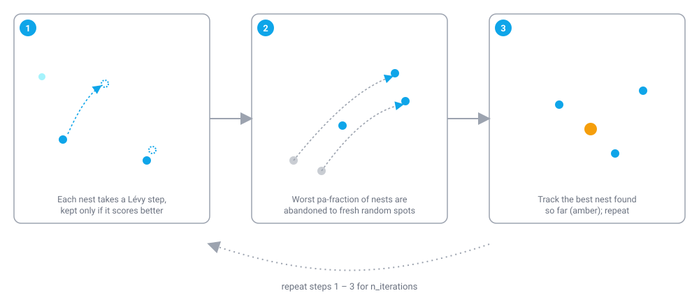

# Cuckoo Search (CS)

!!! abstract "TL;DR"
    Cuckoo Search is a population-based continuous optimizer that mixes small local moves with occasional large "Lévy flight" jumps, then periodically abandons its worst candidates and re-randomizes them. It is a good default when you want exploration-heavy search over a bounded continuous objective and are willing to tune how aggressively bad candidates get discarded. Run it in colonyx with `AutoColony(mode="cs")`.

## What is Cuckoo Search?

Cuckoo Search takes its metaphor from the brood parasitism of certain cuckoo species, which lay their eggs in the nests of other host birds rather than raising their own young. In the algorithm, each "nest" is a candidate solution — a point in the search space — and the population of nests evolves generation by generation. Every iteration, each nest is perturbed by a Lévy-flight step: a heavy-tailed random step that produces mostly small moves with occasionally very large ones, which is a useful property for optimization because it lets the search wander broadly through the space without ever fully abandoning fine-grained local refinement. If the perturbed candidate scores better than the nest it came from, it replaces it. Then, mimicking a host bird discovering and rejecting a parasitic egg, a fraction of the worst-scoring nests are abandoned each iteration and replaced with fresh random positions, which keeps the population from stagnating around a single region of the search space.

<figure markdown>

<figcaption>Lévy steps explore broadly while abandonment keeps the population from stagnating around one region — two separate, complementary sources of diversity.</figcaption>
</figure>

## How colonyx implements it

colonyx's Cuckoo Search runs as a single loop of Lévy-flight moves followed by abandonment, verified against the Rust implementation in `src/algorithms/continuous.rs`:

```text
nests[1..n_nests] <- random positions within bounds
scores <- evaluate(nests)
best <- nest with the lowest score

for iteration in 1..n_iterations:
    for each nest i:
        for each dimension d:
            u, v <- independent draws  # u, v ~ centered noise, one pair per dimension
            step_d <- levy_scale * u / |v|^(1/1.5)
            candidate_d <- clamp(nest[i]_d + cs_alpha * step_d * range_d)
        if score(candidate) < scores[i]:
            nest[i] <- candidate
            scores[i] <- score(candidate)

    abandon_count <- max(1, ceil(pa * n_nests))
    for each of the `abandon_count` worst-scoring nests:
        replace with a random position within bounds; re-evaluate

    update best from the current nests
```

Each nest's step is drawn from two independent uniform variates per dimension. This is a simplified heavy-tailed step rather than the literature's Lévy flight via Mantegna's algorithm and normal draws, but it produces the same qualitative behavior — mostly small moves, occasionally a large one. \(\lambda\) is `levy_scale` and \(\alpha\) is `cs_alpha`, the overall step-scaling factor:

$$
u, v \sim U(-0.5, 0.5), \qquad
\text{step}_j = \lambda \cdot \frac{u_j}{|v_j|^{1/1.5}}
$$

$$
x_{ij} \leftarrow \operatorname{clamp}\!\big(x_{ij} + \alpha \cdot \text{step}_j \cdot \text{range}_j\big)
$$

Abandonment always removes at least one nest, in a count proportional to `pa`:

$$
n_{\text{abandon}} = \max\!\big(1,\ \lceil pa \cdot n_{\text{nests}} \rceil\big)
$$

## When to use it (and when not to)

Reach for Cuckoo Search when you want a continuous optimizer that leans toward exploration rather than fast convergence — the combination of heavy-tailed steps and periodic abandonment is good at escaping shallow local optima on rugged, multimodal objectives. It is a reasonable alternative to [Particle Swarm Optimization](pso.md) when PSO keeps converging prematurely on the same local minimum, since CS has no velocity/momentum term pulling every candidate toward a shared best position. It is not the best choice when you need fast, smooth convergence on a well-behaved (roughly convex or mildly multimodal) objective — [Differential Evolution](de.md) or plain PSO will usually get there in fewer iterations with less tuning. If your landscape is ill-conditioned or has strong correlations between dimensions, [CMA-ES](cmaes.md) will typically outperform CS because it adapts its search distribution to the local shape of the objective, something CS's per-dimension Lévy steps do not do.

## Parameters

| Parameter | Default | Meaning | Tuning guidance |
|---|---|---|---|
| `n_nests` | `25` | Population size — number of candidate solutions maintained per generation. | Increase for higher-dimensional or more rugged objectives; each extra nest costs one more objective evaluation per iteration. |
| `pa` | `0.25` | Fraction of the worst-scoring nests abandoned and re-randomized each iteration. | Higher values (closer to `0.4`) increase exploration and help escape local optima at the cost of convergence speed; lower values let good regions be refined for longer before being discarded. |
| `cs_alpha` | `0.01` | Step-size scale applied to the Lévy step (passed to the Rust `CuckooSearch` constructor as `alpha`). | Larger values take bigger jumps per iteration — useful early on or on wide search spaces, but can overshoot narrow optima if left too high throughout the run. |
| `levy_scale` | `1.0` | Overall scale of the Lévy-flight step before `cs_alpha` is applied. | Tune alongside `cs_alpha`; the two multiply together, so changing one changes the effective step size the same way as changing the other. |
| `n_iterations` | `100` | Number of generations to run (shared across all `AutoColony` modes). | Increase for harder or higher-dimensional problems; watch `score_history_` for a plateau before spending a larger budget. |

## Example

```python
from colonyx import AutoColony

def sphere(x):
    return sum(xi * xi for xi in x)

optimizer = AutoColony(mode="cs", n_iterations=100, pa=0.25, random_state=7)
optimizer.fit(sphere, bounds=[(-5, 5), (-5, 5)])

optimizer.predict()  # best position found, ~ [0, 0]
optimizer.score()    # objective value at that position, ~ 0
```

## Further reading

- Yang, X.-S. and Deb, S. (2009). *Cuckoo Search via Lévy Flights*. World Congress on Nature & Biologically Inspired Computing (NaBIC).
- [Algorithms overview](../algorithms.md) — compare Cuckoo Search against every other algorithm colonyx ships.
- [AutoColony API reference](../autocolony-api.md) — the unified `mode=` interface used above.
