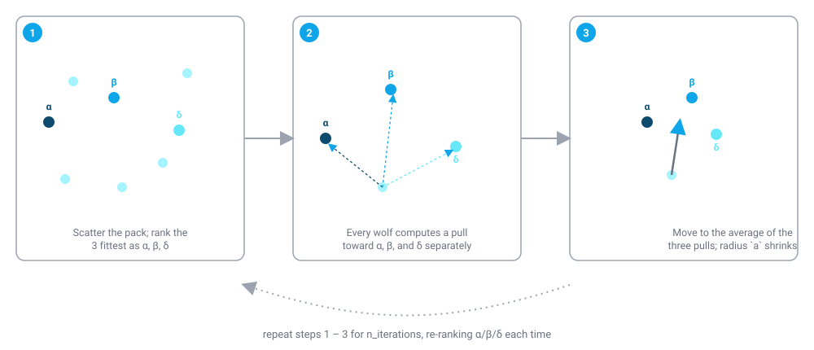

# Grey Wolf Optimization (GWO)

!!! abstract "TL;DR"
    The Grey Wolf Optimizer is a compact, population-based continuous optimizer with only one tunable size parameter (`n_wolves`) — the whole pack is guided by its three fittest members each iteration, with no separate inertia or attraction coefficients to configure. In colonyx it's `AutoColony(mode="gwo")`, a good choice when you want leader-guided search with minimal tuning surface.

## What is Grey Wolf Optimization?

The Grey Wolf Optimizer is inspired by the social hierarchy and hunting behavior of grey wolf packs. A wolf pack is organized into a strict dominance hierarchy: the alpha (or alpha pair) leads decision-making, the beta supports and may eventually succeed the alpha, the delta wolves defer to alpha and beta but dominate the lowest-ranked omega wolves, and hunting itself proceeds in coordinated stages — the pack tracks and encircles prey, then closes in and attacks once the prey is sufficiently surrounded. GWO borrows the encircling-and-converging structure of this hunt as its search mechanism, treating "prey" as an unknown location that stands in for the true optimum.

<figure markdown>

<figcaption>Alpha, beta, and delta are just the three best solutions found so far — the hierarchy is recomputed from scratch every iteration, not fixed to specific wolves.</figcaption>
</figure>

At every iteration, the three best solutions found so far by the population play the role of alpha, beta, and delta — the pack's three best current guesses about where the prey (optimum) actually is. Every other wolf, including alpha/beta/delta themselves, updates its own position by computing where each of the three leaders would tell it to move (a coordinate that circles around that leader at a distance controlled by random coefficients), and then averaging those three leader-guided suggestions. A single scalar `a` starts at 2 and shrinks linearly to 0 over the run, which widens the circling radius early (encouraging broad exploration around the leaders) and tightens it late (encouraging the pack to converge tightly on the leaders' consensus position) — this is GWO's built-in exploration-to-exploitation schedule, and it requires no manual tuning.

## How colonyx implements it

The core loop colonyx's Rust implementation (`colonyx._colonyx.GreyWolfOptimizer`) runs is:

```text
wolves = random init inside bounds
scores = evaluate(wolves)                            # batched, in parallel

for iteration in 1..n_iterations:
    alpha, beta, delta = the 3 wolves with lowest score
    a = 2 * (1 - iteration / (n_iterations - 1))      # decays 2 -> 0

    for each wolf:
        for each dimension d, and for each leader in {alpha, beta, delta}:
            r1, r2 = random(0, 1), random(0, 1)
            A = 2*a*r1 - a
            C = 2*r2
            x_leader = leader[d] - A * abs(C * leader[d] - wolf[d])
        wolf[d] = clamp(mean(x_alpha, x_beta, x_delta))
    scores = evaluate(wolves)
    track best (wolf, score) seen so far
```

### The leader-guided position-update math

The exploration coefficient decays linearly over the run, from 2 to 0:

$$
a_t = 2\left(1 - \frac{t}{T-1}\right), \qquad t = 0, \dots, T-1
$$

For each leader \(k \in \{\alpha, \beta, \delta\}\), with independently drawn \(r_1, r_2 \sim U(0,1)\) per dimension per leader:

$$
A_k = 2 a_t r_1 - a_t, \qquad C_k = 2 r_2
$$

$$
D_k = \left| C_k X_k - X \right|, \qquad X_k' = X_k - A_k D_k
$$

The wolf's new position is the (clamped) average of the three leader-guided estimates:

$$
X \leftarrow \operatorname{clamp}\!\left(\frac{X_\alpha' + X_\beta' + X_\delta'}{3}\right)
$$

## When to use it (and when not to)

GWO is a good pick when you want a leader-guided continuous optimizer but would rather not tune inertia/cognitive/social-style coefficients the way [PSO](pso.md) requires — GWO's only algorithm-specific knob is the swarm size, `n_wolves`, since the exploration/exploitation balance is handled automatically by the decaying `a` schedule. It tends to converge reliably on unimodal and moderately multimodal problems. If your landscape is strongly multimodal and you want the population to spread across several regions rather than always averaging toward three fixed leaders, the [Firefly Algorithm](fa.md) (pairwise, distance-based attraction) is a closer fit. For very high-dimensional problems, also compare against [Artificial Bee Colony](abc.md) or [CMA-ES](cmaes.md). GWO is not suited to discrete tour/permutation problems — see [ACO](aco.md) for those.

## Parameters

| Parameter | Default | Meaning | Tuning guidance |
|---|---|---|---|
| `n_wolves` | `30` | Number of wolves in the pack. | More wolves cover the search space more thoroughly per iteration; 20-60 is typical, scale up for higher-dimensional problems. |
| `n_iterations` | `100` | Number of pack iterations to run. | GWO's exploration-to-exploitation transition is tied directly to `n_iterations` (via the `a` schedule), so increasing it both gives the search more time *and* stretches out the exploration phase — don't set it too low or the pack will converge before it has explored enough. |

## Example

```python
from colonyx import AutoColony

optimizer = AutoColony(mode="gwo", n_iterations=100, random_state=7)
optimizer.fit(lambda x: sum(v * v for v in x), bounds=[(-5, 5), (-5, 5)])
print(optimizer.predict(), optimizer.score())
```

## Further reading

- Mirjalili, S., Mirjalili, S. M., & Lewis, A. (2014). *Grey Wolf Optimizer.* Advances in Engineering Software, 69, 46-61 — the original GWO paper.
- [Algorithms overview](../algorithms.md) — compare GWO against every other algorithm colonyx ships.
- [AutoColony API reference](../autocolony-api.md) — the full unified interface.
