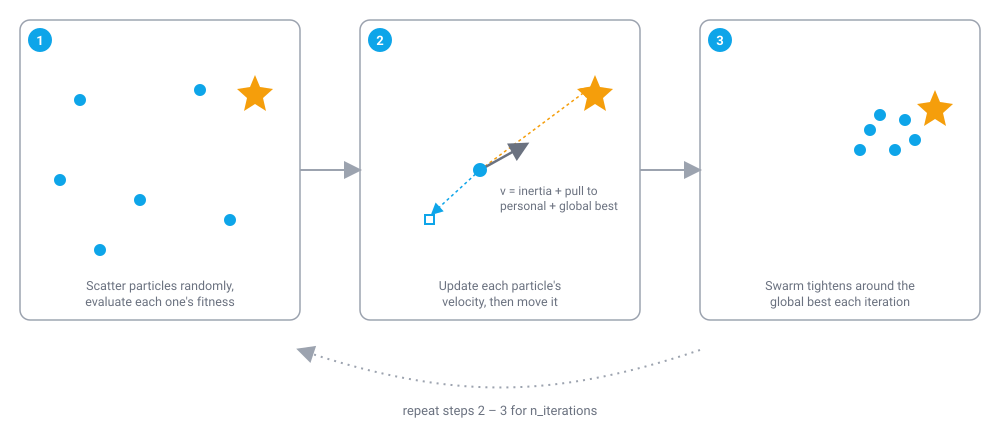

# Particle Swarm Optimization (PSO)

!!! abstract "TL;DR"
    Particle Swarm Optimization is a population-based continuous optimizer where particles move through the search space guided by their own best-known position and the swarm's best-known position. In colonyx it's the default choice for low-dimensional continuous problems (`AutoColony(mode="pso")`, or automatically under `mode="auto"`) and needs only a callable objective plus box `bounds` — no gradients required.

## What is Particle Swarm Optimization?

Particle Swarm Optimization is loosely modeled on the coordinated movement of a flock of birds or a school of fish searching for food. No single bird knows where the food is, but each bird has a memory of the best spot it has personally found so far, and every bird also observes (or can be told) the best spot anyone in the flock has found so far. Each bird's next move is a compromise between continuing its own trajectory, drifting back toward its own best-known spot, and drifting toward the flock's best-known spot. Individually simple, locally-informed movements like this let the flock as a whole cover the search space efficiently and converge on good regions without any bird performing a global search on its own.

<figure markdown>

<figcaption>Velocity blends three pulls — inertia, personal best, and global best — so the swarm converges without ever computing a gradient.</figcaption>
</figure>

PSO translates this into a numerical optimizer for continuous, real-valued problems: minimize an objective function \(f(x)\) over a box-constrained search space. A "particle" is a candidate solution vector plus a velocity vector; a "swarm" is a population of such particles. Each particle tracks its own personal-best position (the best point it has individually visited) and the whole swarm shares a global-best position (the best point anyone in the swarm has visited). At every iteration, each particle's velocity is nudged toward both of those attractors by a random amount, and the particle then moves according to its updated velocity. Because the pull toward the personal best encourages continued local refinement and the pull toward the global best encourages convergence toward the swarm's consensus, PSO balances individual exploration against collective exploitation without ever needing to compute a gradient of \(f\).

## How colonyx implements it

The core loop colonyx's Rust implementation (`colonyx._colonyx.ParticleSwarm`) runs is:

```text
positions, velocities = random init inside bounds  # velocities scaled small
fitness = evaluate(positions)                       # batched, in parallel
personal_best, personal_best_fitness = positions, fitness
global_best, global_best_fitness = argmin(fitness)

for iteration in 1..n_iterations:
    for i in 1..n_particles:
        for each dimension d:
            r1, r2 = random(0, 1), random(0, 1)
            velocity[i][d] = w * velocity[i][d]
                           + c1 * r1 * (personal_best[i][d] - position[i][d])
                           + c2 * r2 * (global_best[d]      - position[i][d])
            position[i][d] += velocity[i][d]
        clamp position[i] to bounds
        fitness_i = evaluate(position[i])
        if fitness_i < personal_best_fitness[i]:
            personal_best[i], personal_best_fitness[i] = position[i], fitness_i
            if fitness_i < global_best_fitness:
                global_best, global_best_fitness = position[i], fitness_i
```

Every particle's fitness is evaluated in a batched pass each iteration (the Rust core parallelizes this), which is a large part of why colonyx's PSO is fast even for objective functions that are called thousands of times over a run.

### The velocity-update math

For particle \(i\), dimension \(d\), at iteration \(t\), with independently drawn \(r_1, r_2 \sim U(0,1)\) per dimension per particle per step:

$$
v_{i,d} \leftarrow w\,v_{i,d} + c_1 r_1 \,(p_{i,d} - x_{i,d}) + c_2 r_2\,(g_d - x_{i,d})
$$

$$
x_{i,d} \leftarrow x_{i,d} + v_{i,d}
$$

where \(p_i\) is particle \(i\)'s personal-best position and \(g\) is the swarm's global-best position. \(x_i\) is then clamped back into `bounds`, and \(p_i\)/\(g\) are updated whenever the clamped \(x_i\) improves on them.

## When to use it (and when not to)

PSO is a strong general-purpose default for smooth, low-to-moderate-dimensional continuous objectives — it's exactly why colonyx's `mode="auto"` picks it for continuous problems with 4 or fewer dimensions (see [Getting Started](../getting-started.md)). It tends to converge quickly on unimodal or mildly multimodal landscapes. For higher-dimensional continuous problems, [Artificial Bee Colony](abc.md) (colonyx's other `auto`-selectable mode) or [CMA-ES](cmaes.md) (which adapts a full covariance matrix rather than a single global attractor) often scale better. If your landscape is highly multimodal and you want a population that naturally spreads across several promising regions instead of funneling everything toward one global best, consider the [Firefly Algorithm](fa.md) or [Grey Wolf Optimizer](gwo.md). PSO is not applicable to discrete, tour-construction problems like TSP — use [Ant Colony Optimization](aco.md) for those.

## Parameters

| Parameter | Default | Meaning | Tuning guidance |
|---|---|---|---|
| `n_particles` | `30` | Number of particles in the swarm. | More particles cover the search space more thoroughly per iteration; 20-50 is typical, scale up for higher-dimensional problems. |
| `w` | `0.9` | Inertia weight — how much of the previous velocity carries over. | Higher values favor exploration (particles keep moving in their current direction); lower values favor exploitation. A common trick outside colonyx's fixed-`w` implementation is to decay `w` over the run — here you'd instead just lower the default if you want more convergence pressure. |
| `c1` | `2.0` | Cognitive coefficient — pull strength toward the particle's own personal best. | Higher values make particles trust their own history more; very high values can cause particles to orbit their personal best without converging to the swarm optimum. |
| `c2` | `2.0` | Social coefficient — pull strength toward the swarm's global best. | Higher values speed convergence toward the current global best but risk premature convergence on a local optimum before the swarm has explored enough. |
| `n_iterations` | `100` | Number of swarm iterations to run. | Increase for harder or higher-dimensional objectives; PSO usually shows most of its improvement early, then refines. |

## Example

```python
from colonyx import AutoColony

optimizer = AutoColony(mode="pso", n_iterations=100, random_state=7)
optimizer.fit(lambda x: sum(v * v for v in x), bounds=[(-5, 5), (-5, 5)])
print(optimizer.predict(), optimizer.score())
```

## Further reading

- Kennedy, J., & Eberhart, R. (1995). *Particle swarm optimization.* Proceedings of ICNN'95 — International Conference on Neural Networks — the original PSO paper.
- [Algorithms overview](../algorithms.md) — compare PSO against every other algorithm colonyx ships.
- [AutoColony API reference](../autocolony-api.md) — the full unified interface.
