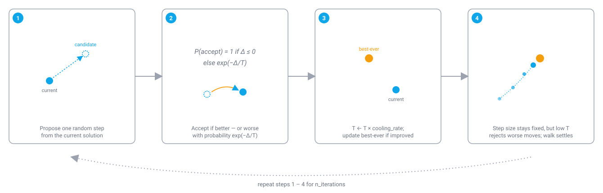

# Simulated Annealing (SA)

!!! abstract "TL;DR"
    Simulated Annealing is a single-solution continuous optimizer — unlike every other algorithm colonyx ships, it maintains no population at all. It takes one random step at a time, always accepts an improving step, and accepts a worsening step with a probability that shrinks as the search "cools." In colonyx it's `AutoColony(mode="sa")`, the lightest-weight optimizer in the library.

## What is Simulated Annealing?

Simulated Annealing is modeled on annealing in metallurgy: a metal is heated until its atoms can move freely, then cooled slowly, and the slow cooling lets the atoms settle into a low-energy, highly ordered crystalline structure rather than the disordered, higher-energy structure that would result from cooling too quickly. The physical intuition is that at high temperature, atoms have enough energy to escape a locally low-energy arrangement and keep searching for a better (lower-energy) one; as temperature drops, that escape energy shrinks, and the material progressively settles into whatever arrangement it's found.

<figure markdown>

<figcaption>The step size never shrinks — what changes is the temperature-controlled odds of accepting a worse move, which is what lets SA settle down over time.</figcaption>
</figure>

SA reuses this cooling schedule as a search strategy for continuous optimization. It maintains exactly one current candidate solution (not a population), and at each iteration proposes a randomly perturbed neighbor of that solution. If the neighbor's objective value is better, it's always accepted as the new current solution. If it's worse, it's accepted anyway with a probability that depends on how much worse it is and on a "temperature" parameter that starts high and decreases geometrically every iteration — early in the run, temperature is high, so SA readily accepts worsening moves and can escape a local optimum it would otherwise be stuck in; late in the run, temperature has cooled close to zero, so SA effectively only accepts improving moves and behaves like plain greedy hill-descending. This is the same fundamental trade-off every other algorithm on this site handles with a population and diversity mechanisms, but SA achieves it with a single trajectory and one scalar temperature.

## How colonyx implements it

The core loop colonyx's Rust implementation (`colonyx._colonyx.SimulatedAnnealing`) runs is:

```text
current = random position inside bounds
current_score = evaluate(current)
best = current, best_score = current_score
temperature = initial_temperature

for iteration in 1..n_iterations:
    candidate = current + random_step_scaled_by(step_scale)   # per dimension
    clamp candidate to bounds
    candidate_score = evaluate(candidate)
    delta = candidate_score - current_score
    if delta <= 0 or random(0, 1) < exp(-delta / temperature):
        current, current_score = candidate, candidate_score   # accept (maybe worse)
    if current_score < best_score:
        best, best_score = current, current_score
    temperature *= cooling_rate
```

Note that SA tracks the *best-ever* solution separately from the *current* solution — because worsening moves are sometimes accepted (that's the whole point), the current solution can be worse than the best one already found, so `.predict()`/`.score()` always report the best-ever solution, not wherever the walk happens to currently be.

### The Metropolis acceptance criterion

Let \(\Delta = f(x') - f(x)\) be the change in objective value for a candidate step \(x'\). It's accepted (replacing the current solution) with probability:

$$
P(\text{accept}) = \begin{cases} 1 & \Delta \le 0 \\[4pt] \exp\!\left(-\dfrac{\Delta}{T}\right) & \Delta > 0 \end{cases}
$$

The temperature cools geometrically each iteration, where \(\alpha\) is `cooling_rate`:

$$
T \leftarrow T \cdot \alpha
$$

so \(P(\text{accept})\) for a fixed worsening \(\Delta\) shrinks over the run, moving SA from broad exploration toward pure hill-descending.

## When to use it (and when not to)

SA is the right tool when you want the lightest-weight optimizer in colonyx — no population to size, just a step scale and a cooling schedule — and your objective is cheap enough (or your iteration budget large enough) that a single random-walk trajectory can adequately explore the space. It's a reasonable first thing to try on a new continuous problem before reaching for a population-based method, precisely because it has so few moving parts to get wrong. Because it maintains only one candidate at a time, though, it generally explores less thoroughly per iteration than a population-based method with the same iteration budget, and can be slower to escape a deep local optimum on a rugged landscape than something like the [Firefly Algorithm](fa.md), which maintains many candidates spread across the space simultaneously. For most moderately-complex continuous problems, [PSO](pso.md) or [Artificial Bee Colony](abc.md) (colonyx's `auto`-selected defaults) will out-perform SA at a similar iteration budget — SA's strength is its simplicity and low per-iteration cost, not raw solution quality. SA does not handle discrete tour/permutation problems — see [ACO](aco.md) for those.

## Parameters

| Parameter | Default | Meaning | Tuning guidance |
|---|---|---|---|
| `initial_temperature` | `10.0` | Starting temperature — controls how readily worsening moves are accepted early in the run. | Raise it if the objective's typical worsening-delta is large relative to 10.0, so early acceptance probabilities stay meaningfully above zero; lower it for objectives with a small typical delta. |
| `cooling_rate` | `0.95` | Multiplicative factor applied to temperature every iteration. | Values closer to 1.0 cool more slowly (more exploration, needs more iterations to converge); values further below 1.0 cool faster (converges sooner, but risks settling into a local optimum before finding a better region). |
| `step_scale` | `0.1` | Size of the random perturbation used to generate each candidate neighbor. | Larger steps explore more of the space per iteration but can overshoot narrow optima; smaller steps refine more precisely but explore more slowly. |
| `n_iterations` | `100` | Number of annealing steps to run. | Increase alongside a slower `cooling_rate` so temperature has time to fully cool over the run. |

## Example

```python
from colonyx import AutoColony

optimizer = AutoColony(mode="sa", n_iterations=100, random_state=7)
optimizer.fit(lambda x: sum(v * v for v in x), bounds=[(-5, 5), (-5, 5)])
print(optimizer.predict(), optimizer.score())
```

## Further reading

- Kirkpatrick, S., Gelatt, C. D., & Vecchi, M. P. (1983). *Optimization by simulated annealing.* Science, 220(4598), 671-680 — the original Simulated Annealing paper.
- [Algorithms overview](../algorithms.md) — compare SA against every other algorithm colonyx ships.
- [AutoColony API reference](../autocolony-api.md) — the full unified interface.
